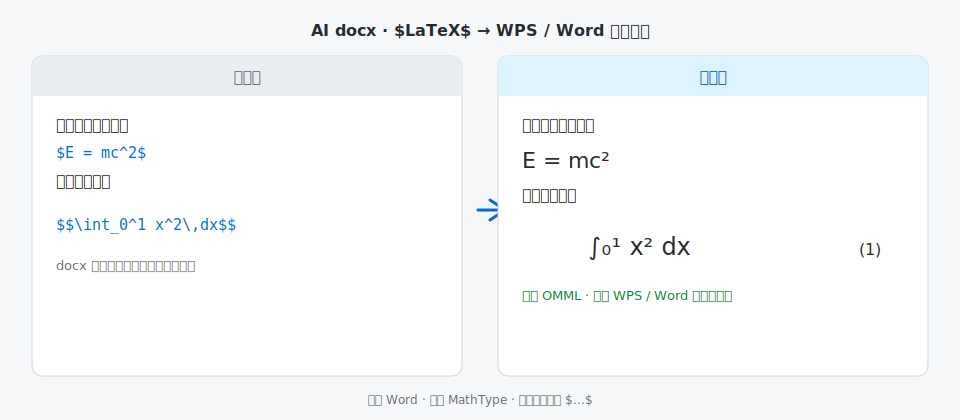

# WPS-LaTeX2Equation-tool

[](https://github.com/cgflag/WPS-LaTex2Equation-tool/releases)
[](LICENSE)
[](https://www.python.org/)
[](https://github.com/cgflag/WPS-LaTex2Equation-tool/actions/workflows/ci.yml)

**[中文](#中文)** · **[English](#english)** · [示例对比](examples/) · [更新日志](CHANGELOG.md)

---

<a id="中文"></a>

## 中文

**把 AI 写进 docx 的 `$...$` / `$$...$$` 批量转成 WPS / Word 原生可编辑公式。**  
（「ChatGPT / Gemini 写的公式一键进 WPS」——当前对 **Gemini** 输出兼容最好。）

不启动 Word、不用 MathType、运行时不调 COM；块级公式自动居中并编号 `(1)(2)…`。



| 转换前 | 转换后 |
|--------|--------|
| [`examples/demo_before.docx`](examples/demo_before.docx) | [`examples/demo_after.docx`](examples/demo_after.docx) |

用 **WPS 文字** 或 Word 打开上表两个脱敏示例即可对比。

### 为什么需要它

写论文、写专利时经常要敲大量公式，自己在 Word/WPS 里手搓很慢。更高效的做法是：让 AI 先产出 `$...$` 公式代码，再一键转成真正能双击编辑的公式。

| 痛点 | 本工具 |
|------|--------|
| docx 里公式还是 `$E=mc^2$` 纯文本 | 转为 **WPS/Word 原生 OMML** |
| MathType 收费；WPS 上 VBA / `OMaths` 不稳定 | **无需 MathType**；运行时 **不调用 Word COM** |
| 独立段公式要居中并编号 | 识别 `$$...$$` / 整段 `$...$`，**制表位居中 + (n)** |
| 怕转换失败毁掉整篇 | 失败处 **保留原 `$...$` 文本** |

**原理**：直接改写 docx 内的 `document.xml`（LaTeX → MathML → OMML），**不启动 Word 进程**。

### 适合谁用

- 用 **Gemini**（以及其他会输出 `$...$` 的 AI）写文档，导出后公式仍是纯文本
- 日常用 **WPS 文字**，不想装 MathType，也不想碰容易报错的宏
- 需要块级公式居中 + `(1)(2)(3)…` 编号

### 快速开始

#### 环境要求

| 项目 | 说明 |
|------|------|
| Python | 3.10 及以上 |
| `MML2OMML.XSL` | 来自 **Microsoft Office** 安装目录（只做格式转换，日常仍可用 WPS 排版） |
| WPS / Word | 用于查看、编辑输出 docx |

常见 XSL 路径（Windows）：

```
C:\Program Files\Microsoft Office\root\Office16\MML2OMML.XSL
```

#### 安装

```bash
git clone https://github.com/cgflag/WPS-LaTex2Equation-tool.git
cd WPS-LaTex2Equation-tool
python -m venv .venv
.venv\Scripts\activate
pip install -e .
```

也可：`pip install -r requirements.txt`（不含命令行别名）。

#### 图形界面（GUI）

```bash
pip install -e ".[gui]"
wps-latex2equation-gui
# 或
python -m gui
```

选择或 **拖拽** docx → **开始转换** → 默认另存为 `原名_公式版.docx`。

#### 命令行

```bash
python convert_latex_docx.py examples/demo_before.docx examples/demo_after.docx
```

安装 `-e` 后：

```bash
docx-latex-math 你的文档.docx 输出.docx
# 旧别名：patent-math 你的文档.docx 输出.docx
```

#### 常用参数

```bash
python convert_latex_docx.py 说明书.docx 说明书_公式版.docx --size 小四
python convert_latex_docx.py 说明书.docx out.docx --tab-mode page
set PATENT_MATH_MML2OMML=C:\Program Files\Microsoft Office\root\Office16\MML2OMML.XSL
python convert_latex_docx.py 说明书.docx out.docx --xsl "%PATENT_MATH_MML2OMML%"
```

#### 公式写法

| 写法 | 效果 |
|------|------|
| 句中 `$E=mc^2$` | 行内公式 |
| 整段只有 `$$...$$` 或单独一行 `$...$` | 块级：居中 + 右侧 `(1)(2)...` |
| 某条解析失败 | 保留 `$...$` 原文 |

### 开源范围

| 内容 | 说明 |
|------|------|
| ✅ **MIT 开源** | CLI、GUI、LaTeX→OMML、行内/块级识别、制表位编号 |
| 🔒 未包含 | 批量文件夹、模板 preset、题注/目录一体化 |

桌面版 **exe** 另发；本仓库面向可自行安装 Python 的用户与开发者。

### 项目结构

```
WPS-LaTex2Equation-tool/
├── convert_latex_docx.py
├── gui/
├── assets/            # README 配图
├── examples/          # 脱敏演示 docx
├── tests/
└── .github/workflows/
```

### 开发

```bash
pip install -e ".[dev]"
pytest -q
```

### 已知限制

- 仅处理正文 `word/document.xml`（不含页眉页脚、文本框、表格）
- LaTeX 子集受 `latex2mathml` 限制
- `MML2OMML.XSL` 需本机 Office，不能随仓库分发

### GitHub 仓库 About（建议粘贴）

- **简介：** `AI 输出的 $LaTeX$ → WPS/Word 原生公式（无 COM、无 MathType）`
- **Topics：** `wps` `latex` `docx` `omml` `equation` `gemini` `chatgpt` `word` `python`

### 许可证

[MIT](LICENSE) · Copyright (c) 2026 [cgflag](https://github.com/cgflag)

---

<a id="english"></a>

## English

**[中文](#中文)** · **[English](#english)**

Convert AI-emitted `$...$` / `$$...$$` in `.docx` into native **OMML** for **WPS** and Word.  
(Casual: “one-click AI formulas into WPS” — works best with **Gemini** output today.)

No MathType, no Word COM at runtime. Display math is centered with `(1)(2)…` numbering.

Writing papers or patents usually means a lot of equations; typing them by hand in Word/WPS is slow. A practical workflow is: let AI emit `$...$` code, then batch-convert to editable equations.

```bash
pip install -e ".[gui]"
python -m gui
# or
python convert_latex_docx.py examples/demo_before.docx examples/demo_after.docx
```

Requires `MML2OMML.XSL` from Microsoft Office.  
Desktop **exe** builds (if any) are distributed separately; this repo is source + CLI/GUI.

See the [中文](#中文) section for full docs, limits, and examples.

License: [MIT](LICENSE)
